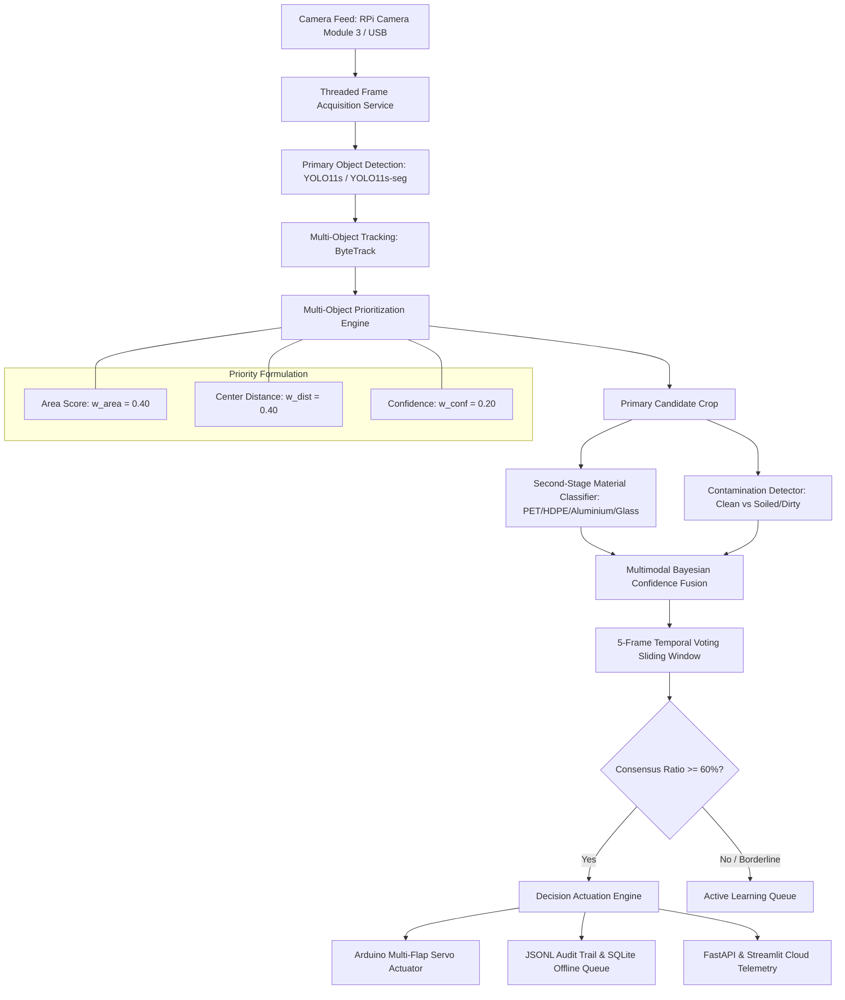

# SmartBin AI v2 — Production System Architecture

## 1. System Overview

SmartBin AI v2 is an industrial-grade, edge-deployable computer vision waste segregation system engineered for real-time operation on Raspberry Pi 5 (scalable to NVIDIA Jetson Nano/Orin). It automates the multi-compartment segregation of municipal and consumer waste into four distinct physical streams: **Recyclable**, **Compost (Organic)**, **Landfill**, and **Reject (Contaminated/Unknown)**.

---

## 2. Multi-Stage Pipeline Breakdown

### Stage 1: Optical Acquisition & Letterboxing
- Utilizes the **Raspberry Pi Camera Module 3** via native `picamera2` bindings with hardware auto-exposure (`sports` mode) to eliminate motion blur from falling waste.
- Decoupled threaded camera worker continuously refreshes internal frame buffer, ensuring `< 1ms` frame fetch latency and zero buffer queue lag.

### Stage 2: Primary Detection & Instance Segmentation
- **Model**: Ultralytics YOLO11s default (or YOLO11s-seg for polygon instance masks).
- Detects 28 Indian municipal waste categories with anchor-free spatial heads and dynamic feature pyramid networks (C3k2 blocks).

### Stage 3: ByteTrack Spatial-Temporal Object Tracking
- Eliminates identity switches between consecutive frames.
- Low-confidence detections are associated in a second-stage matching step, preventing false negatives during brief occlusions.

### Stage 4: Multi-Object Prioritization Logic
When multiple waste items appear simultaneously in the bin hopper, the system computes an analytical priority score:
$$\text{Score} = w_{\text{area}} \cdot A_{\text{norm}} + w_{\text{dist}} \cdot (1 - D_{\text{norm}}) + w_{\text{conf}} \cdot \text{Conf}$$
- $A_{\text{norm}}$: Normalized bounding box area fraction.
- $D_{\text{norm}}$: Normalized Euclidean distance from chute optical center $(W/2, H/2)$.
- Selects the single dominant item to receive actuation.

### Stage 5: Material Classification & Contamination Re-routing
- **Material Classifier**: Evaluates resin grades (e.g. PET vs HDPE vs LDPE; Aluminium vs Steel; Clear vs Amber Glass).
- **Contamination Check**: Examines surface texture for oil stains, wet food residue, and grease patches. If a recyclable item is soiled, it is automatically re-routed to Landfill or Reject to protect recycling stream purity.

### Stage 6: Temporal Voting & Stability Lock
- Gathers decisions across a 5-frame sliding window.
- Requires $\ge 60\%$ majority consensus before firing the physical servo, eliminating actuator chatter.

### Stage 7: Actuation & Audit Telemetry
- Serial packet `SORT:<compartment_id>\n` is dispatched to Arduino microcontroller.
- Decision event is logged to `decisions.jsonl` and persisted in SQLite `offline_events.db`.
